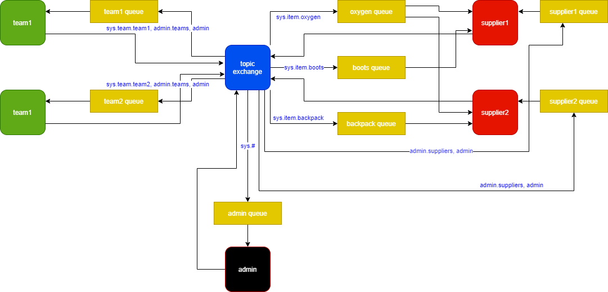

# lab2 - RabbitMQ
## System that distributes orders from teams to suppliers
- Teams make orders.
- Suppliers receive orders and sent back confirmations of deliveries.
- Admin module receives all the messages and can send a message to all the teams, all the suppliers or all the teams and suppliers.
----

